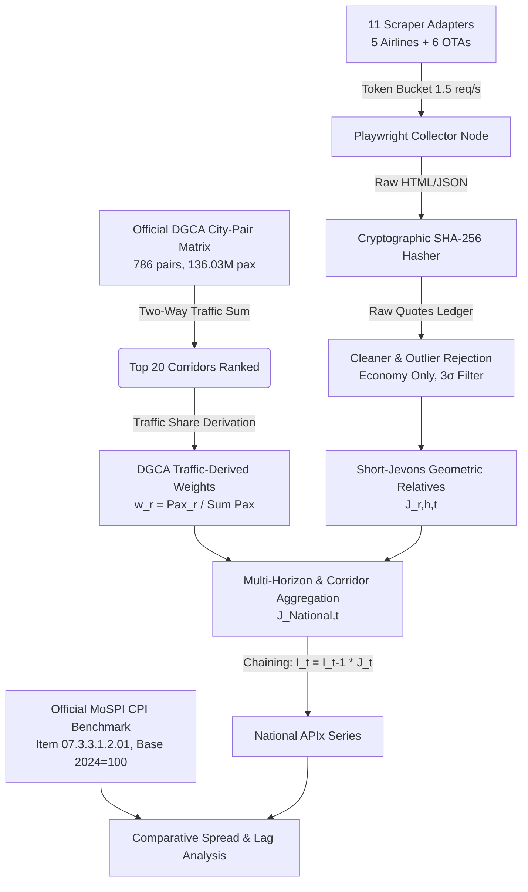

# Aerostat APIx (v2.0.0)
## National Airfare Price Index & High-Frequency CPI Augmentation Platform
### Smart India Hackathon 2026 (SIH26056) &bull; Ministry of Statistics & Programme Implementation (MoSPI) / RBI / DGCA

[](https://vitest.dev)
[](https://developer.mozilla.org/en-US/docs/Web/JavaScript)
[](https://react.dev)
[](https://expressjs.com)
[](https://playwright.dev)
[](https://www.mospi.gov.in)

---

## 1. Executive Summary

**Problem Statement:** MoSPI compiles the Consumer Price Index (CPI) on a monthly basis, publishing figures on the 12th of the following month (a **12 to 42-day reporting lag**). Airfare tariffs in India are dynamically priced using algorithmic revenue management models that experience extreme intra-month volatility. Point-in-time monthly collection fails to capture rapid price shifts, leaving the Reserve Bank of India (RBI) and economic planners with lagged transport inflation signals.

**Aerostat APIx** is a full-stack production platform re-architected on the MERN stack with Playwright browser automation to calculate a high-frequency **Short-Jevons Chained Airfare Price Index**. It continuously tracks India's **Top 20 domestic corridors** across **5 standardized advance booking horizons** ($T+1, T+7, T+15, T+30, T+45$), weighting them using official Directorate General of Civil Aviation (DGCA) scheduled passenger traffic data (136.03M annual passengers).

---

## 2. Institutional Integrity Commitments

Aerostat was redesigned with statutory credibility and transparency:

| Rule | Institutional Commitment | Implementation in Aerostat APIx |
|---|---|---|
| **Rule 1** | **Strict Mode Separation** | Explicit `[MODE: LIVE]` vs `[MODE: DEMO / SIMULATION]` badge displayed on every single screen. |
| **Rule 2** | **No Fabricated Data** | Former fake backtests ($r=0.9858$) and random walk generators removed. Unobserved fields explicitly display `DATA UNAVAILABLE`. |
| **Rule 3** | **Statutory Backtest Rigor** | Backtest page displays `BACKTEST DATA PENDING`, documenting the empirical 6-month uninterrupted data requirement. |
| **Rule 4** | **Dynamic DGCA Traffic Parsing** | Dynamically parses all 786 city-pairs (136,028,655 total passengers) from official DGCA Excel/PDF; derives normalized Top 20 weights. |
| **Rule 5** | **Explicit Weight Labeling** | Weights are legally labeled `DGCA TRAFFIC-DERIVED WEIGHT`, **not** official MoSPI CPI item weights. |
| **Rule 6** | **Short-Jevons Chaining** | Elementary geometric mean of price relatives chained daily: $I_t = I_{t-1} \times J_t$, initialized at 100 on Day 0. |
| **Rule 7** | **Standardized Source Badging** | Every chart and table displays: `[OFFICIAL]`, `[OFFICIAL_DERIVED]`, `[LIVE_COLLECTED]`, `[PROJECT_DERIVED]`, `[DEMO]`, or `[UNAVAILABLE]`. |
| **Rule 8** | **Official MoSPI 2024=100 Series** | Integrated official monthly series for Item `07.3.3.1.2.01` (Air Fare) from Jan 2025 to Aug 2026 (Aug 2026 = 135.49, YoY +20.85%). |
| **Rule 9** | **Ethical Playwright Automation** | 1.5 req/s token bucket rate limiting, robots.txt compliance, no CAPTCHA evasion, transparent error reporting (`BLOCKED`/`UNAVAILABLE`). |
| **Rule 10** | **Preserve Official Metadata** | Retained DGCA document header (*Scheduled Domestic Passenger Traffic 2022-23*) without retroactive edits. |

---

## 3. Technology Stack

- **Backend:** Express.js + Node.js (JavaScript ESM), Mongoose, RESTful API
- **Frontend:** React 18, Vite, JavaScript JSX, Recharts, Lucide Icons, Custom Design System
- **Scraping Engine:** Playwright browser automation (Chromium), Token Bucket Rate Limiter, Robots.txt Checker
- **Database:** MongoDB Atlas / Local MongoDB (with resilient Standalone In-Memory fallback for out-of-the-box evaluation)
- **Testing:** Vitest (25 passing unit & integration tests)

---

## 4. Operational Architecture



---

## 5. Quickstart Guide

### Prerequisites
- Node.js >= 18.0.0
- npm >= 9.0.0

### Installation & Setup
```bash
# Clone repository
git clone https://github.com/Devparth7-coder/Aerostat-V4.git
cd Aerostat-V4

# Install all workspace dependencies
npm run install:all
```

### Build & Test
```bash
# Run 19 automated server tests
npm run test:server

# Build both backend and frontend bundles
npm run build
```

### Launch Production Server
```bash
# Starts Node.js Express server on port 5000 (serves REST API + client SPA)
npm start
```
Open **`http://localhost:5000`** in your browser to access the National Command Center.

### Concurrent Development Mode
```bash
npm run dev
```
- Backend API: `http://localhost:8000/api`
- Vite Dev Server: `http://localhost:5173`

---

## 6. Monitored Corridors & DGCA Weights (Top 5 Sample)

| Rank | Corridor | Cities | Annual Passengers | Network Share | DGCA Basket Weight |
|:---:|:---:|:---:|:---:|:---:|:---:|
| **#1** | `BOM-DEL` | Mumbai &harr; Delhi | 5,615,919 | 4.13% | **11.69%** |
| **#2** | `BLR-DEL` | Bengaluru &harr; Delhi | 4,464,481 | 3.28% | **9.30%** |
| **#3** | `BLR-BOM` | Bengaluru &harr; Mumbai | 3,661,784 | 2.69% | **7.62%** |
| **#4** | `DEL-SXR` | Delhi &harr; Srinagar | 2,801,904 | 2.06% | **5.83%** |
| **#5** | `DEL-CCU` | Delhi &harr; Kolkata | 2,703,923 | 1.99% | **5.63%** |

*Total 20 corridors cover **48,041,180 passengers** (35.4% of total domestic passenger traffic).*

---

## 7. 15 Navigable Platform Modules

1. **National Command Center (`/`)**: High-level KPIs, 30-day chained Recharts curve, India geodesic corridor map.
2. **APIx Index Explorer (`/index-explorer`)**: Multi-horizon series comparison ($T+1$ to $T+45$) with CSV export.
3. **Route Intelligence (`/route-intelligence`)**: 360-degree dossier, advance booking yield curve, carrier capacity comparator.
4. **Route Basket & Weights (`/route-basket`)**: Searchable matrix of all 786 DGCA city-pairs with dynamic Top N selector.
5. **Airline & OTA Source Health (`/source-health`)**: Status cards for 5 Airlines + 6 OTAs with probe execution.
6. **Raw Fare Explorer (`/raw-fares`)**: Filterable fare ledger with cryptographic SHA-256 inspection modal.
7. **Lead-Time Analysis (`/lead-time`)**: Advance booking curve, spot surge vs advance saver discount metrics.
8. **20x5 Route Heatmap (`/route-heatmap`)**: 100-cell market status matrix (`SURGE`, `ELEVATED`, `NORMAL`, `DISCOUNTED`).
9. **MoSPI CPI Benchmark (`/mospi-cpi`)**: Official 2024=100 Airfare series (Item `07.3.3.1.2.01`, Jan 2025 – Aug 2026).
10. **APIx vs CPI Comparison (`/cpi-comparison`)**: High-frequency daily APIx vs official monthly CPI nowcasting spread.
11. **Backtest & Validation (`/backtest`)**: Transparent `BACKTEST DATA PENDING` notice & empirical criteria framework.
12. **Methodology Guide (`/methodology`)**: Mathematical formulations of Jevons, chaining, and statutory limitations.
13. **Data Provenance Ledger (`/provenance`)**: Forensic SHA-256 certificate validation tool.
14. **Alerts & Anomalies (`/alerts`)**: Horizon Inversions, Directional Asymmetries, and volatility spike detectors.
15. **API Documentation (`/api-docs`)**: Interactive REST API documentation with copyable cURL commands.

---

## 8. License & Attribution
Developed for **Smart India Hackathon 2026 (SIH26056)** under the auspices of the **Ministry of Statistics & Programme Implementation (MoSPI)**.
Data sources: Directorate General of Civil Aviation (DGCA) & MoSPI National Statistical Office (NSO).
